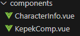

# Általános leírás
Ez a projekt egy *Genshin Impact* karaktereket bemutató alkalmazás, amelyben nagyrészt **Vue.js**-t használtam. A projekt célja, hogy lehetővé tegye a felhasználók számára, hogy megismerkedjenek különböző karakterekkel, képeikkel és részletes információikkal.

# Milyen technológiát használunk

- **Backend**: N/A
- **Frontend**: Vue.js
- **Dizájn**: Bootstrap 5
- **Adatbázis**: N/A (statikus adatok)

# Menüpontok, funkciók
- **Home**: A főoldal, ahol a karakterek listája található.
- **Táblázat**: A karakterek adatait tartalmazó táblázat.
- **Kártyák**: Kedvenc karaktereim bemutatása kártyák formájában.
- **Keresés**: Lehetőség a karakterek keresésére név vagy leírás alapján.
- **Szűrés**: A karakterek szűrése a keresett kifejezések alapján.

# Adatforrássok

## Táblázat

- **Oszlopok**: Karaktereket id-je, neve, ritkasága, vision-je, fegyvere és régiója alapján határozzuk meg.
- **Adatok Hozzáférésének Technológiája**: Az adatok közvetlenül a *Tablazat.vue* komponesben érhetőek el.
- **Példakód**:

## Kártyák

- **Oszlopok**:Karaktereket id-je, neve, profil képe, álló képe és a leírása alapján határozzuk meg.
- **Adatok Hozzáférésének Technológiája**: Az adatok közvetlenül a *Kepek.vue* komponesben érhetőek el.
- **Példakód**:

# A program részletezése

## Könyvtár- és Állományszerkezet

- src/components/

    - **KepekComp.vue**: Egyedi karakterkártyák. Karakterek kártyakomponense, amely a képeket és neveket tartalmazza.
    - **CharacterInfo.vue**: Modal ablak a karakterek részletes információinak megjelenítésére. Modal, amely a kiválasztott karakter részletes adatait jeleníti meg.

    

## Modulok

- src/views/

    - **kepek.vue**: Fő modul a karakter kártyák megjelenítésére.
    - **Tablazat.vue**: Fő modul a táblázat megjelenítésére.

    

- style

    - A oldal stílusát legfőképpen az **App.vue**-ban szerkeztettem.
    - A táblázat kinézetét pedig a **Tablazat.vue**-ban.

# Keresés és szűrés mechanizmusának részletezése

- A karakterek listája szűrhető a felhasználó által beírt keresett szavak alapján.
- A **Find** metódus kiemeli a keresett szavakat a szövegben.

    

## Rendezés táblázaton belül

- Hozzá adtam egy sajátos lehetőséget amivel a táblázaton belül lehet változtatni a sorrednet.

    

